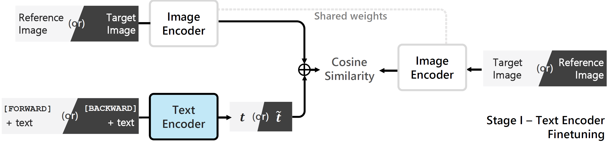
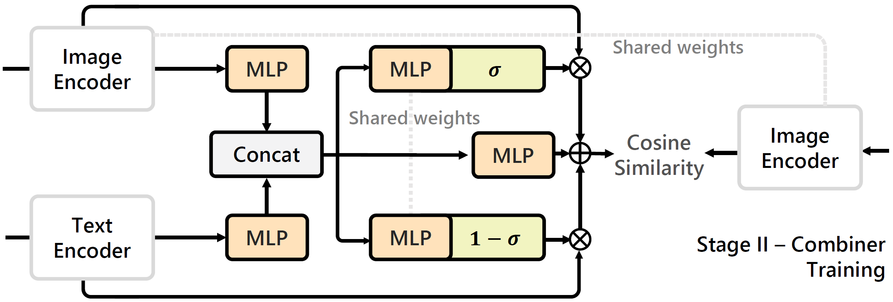

## BLIP4CIR with bi-directional training

<sup>Site navigation > [**Setting up**](#setting-up) &nbsp;|&nbsp; [**Usage**](#usage) &nbsp;|&nbsp; [**Directions for Performance Increase & Further Development** 🔭](#interested-in-further-development-telescope)</sup>

[](https://openaccess.thecvf.com/content/WACV2024/html/Liu_Bi-Directional_Training_for_Composed_Image_Retrieval_via_Text_Prompt_Learning_WACV_2024_paper.html) 
[](https://arxiv.org/abs/2303.16604)

	
[](https://paperswithcode.com/sota/image-retrieval-on-fashion-iq?p=bi-directional-training-for-composed-image)
[](https://paperswithcode.com/sota/image-retrieval-on-cirr?p=bi-directional-training-for-composed-image)

The official implementation for **Bi-directional Training for Composed Image Retrieval via Text Prompt Learning**.

If you find this code useful for your research, please consider citing our work.
```bibtex
@InProceedings{Liu_2024_WACV,
    author    = {Liu, Zheyuan and Sun, Weixuan and Hong, Yicong and Teney, Damien and Gould, Stephen},
    title     = {Bi-Directional Training for Composed Image Retrieval via Text Prompt Learning},
    booktitle = {Proceedings of the IEEE/CVF Winter Conference on Applications of Computer Vision (WACV)},
    month     = {January},
    year      = {2024},
    pages     = {5753-5762}
}
```

##

**News and upcoming updates**

- [x] **Nov-2023** Code and pre-trained checkpoints released for our WACV 2024 paper.
- [x] **Nov-2023** Readme instructions released.

##

If you are interested in this task, feel free to check out [our new work](https://arxiv.org/abs/2305.16304v2) **Candidate Set Re-ranking for Composed Image Retrieval with Dual Multi-modal Encoder**, currently ranked:

[](https://paperswithcode.com/sota/image-retrieval-on-fashion-iq?p=candidate-set-re-ranking-for-composed-image) [](https://paperswithcode.com/sota/image-retrieval-on-cirr?p=candidate-set-re-ranking-for-composed-image).

Code and checkpoints will be released shortly [here](https://github.com/Cuberick-Orion/Candidate-Reranking-CIR). 

## Introduction
Existing approaches on Composed image retrieval (CIR) learn a mapping from the (reference image, modification text)-pair to an image embedding that is then matched against a large image corpus.

One area that has not yet been explored is the reverse direction, which asks the question, what reference image when modified as described by the text would produce the given target image?

We propose a bi-directional training scheme that leverages such reversed queries and can be applied to existing CIR architectures with minimum changes, which improves the performance of the model.
	
Our method is tested on BLIP4CIR, a two-stage approach, as shown below. 
This is a new BLIP-based baseline we proposed on top of the existing method [CLIP4Cir](https://paperswithcode.com/paper/conditioned-and-composed-image-retrieval)[^1].
For details please check out our paper.

<details>
  <summary>Click to see our pipeline</summary>
&emsp; 
	
In the first stage (noted as stage-I), to encode the bi-directional query, we prepend a learnable token to the modification text that designates the direction of the query and then finetune the parameters of the BLIP text embedding module.

<p align="center">
  
</p>

We make no other changes to the network architecture, which allows us to train the second stage (noted as stage-II) as-is, but with queries of both directions.

<p align="center">
  
</p>

&emsp; 
</details>


## Setting up

First, clone the repository to a desired location.

<details>
  <summary><b>Prerequisites</b></summary>
&emsp; 
	
The following commands will create a local Anaconda environment with the necessary packages installed.

```bash
conda create -n cirr_dev -y python=3.8
conda activate cirr_dev
pip install -r requirements.txt
```

&emsp; 
</details>

<details>
  <summary><b>BLIP pre-trained checkpoint</b></summary>
&emsp; 
	
Download the [BLIP pre-trained checkpoint](https://storage.googleapis.com/sfr-vision-language-research/BLIP/models/model_base.pth), verify with `SHA1: 5f1d8cdfae91e22a35e98a4bbb4c43be7bd0ac50`.

By default, we recommend storing the downloaded checkpoint file at `models/model_base.pth`.

Here, we use **BLIP w/ ViT-B**. For BLIP checkpoint options, see [here](https://github.com/salesforce/BLIP#pre-trained-checkpoints).

&emsp; 
</details>

<details>
  <summary><b>Datasets</b></summary>
&emsp; 
	
Experiments are conducted on two standard datasets -- [Fashion-IQ](https://github.com/XiaoxiaoGuo/fashion-iq) and [CIRR](https://github.com/Cuberick-Orion/CIRR#download-cirr-dataset), please see their repositories for download instructions. 

The downloaded file structure should [look like this](https://github.com/ABaldrati/CLIP4Cir#data-preparation).

&emsp; 
</details>

<details>
  <summary>Optional -- Set up Comet</summary>
&emsp; 
	
We use comet to log the experiments. If you are unfamiliar with it, see [the quick start guide](https://www.comet.com/docs/v2/guides/getting-started/quickstart/). You will need to obtain an API Key for `--api-key` and create a personal workspace for `--workspace`. 

If these arguments are not provided, the experiment will be logged only locally.

&emsp; 
</details>

> [!NOTE]
> The code has been tested on PyTorch 1.11.0 and 2.1.1. Modify the requirement file to specify your PyTorch/CUDA versions.

## Code breakdown

Our code is based on [CLIP4Cir](https://github.com/ABaldrati/CLIP4Cir)[^1] with additional modules from [BLIP](https://github.com/salesforce/BLIP).

From the perspective of implementation, compared to the original CLIP4Cir codebase, differences are mostly in the following two aspects:

 - we replaced the CLIP image/text encoders with BLIP as defined in `src/blip_modules/`;
 - we involve the reversed queries during training, which are constructed on the fly (see codeblocks surrounding `loss_r` in `src/clip_fine_tune.py, src/combiner_train.py`).

A brief introduction to the CLIP4Cir codebase is in [CLIP4Cir - Usage](https://github.com/ABaldrati/CLIP4Cir/tree/a6cd95d9f00a3aa8fa5ab4eb1d0442518d28ad7f#usage).
The structures are mostly preserved, though we have made changes to the scripts.

[^1]: Our code is based on [this specific commit](https://github.com/ABaldrati/CLIP4Cir/tree/a6cd95d9f00a3aa8fa5ab4eb1d0442518d28ad7f) of CLIP4Cir. Note that their code has since been updated to a newer version, see [**Directions for Further Development** 🔭](#interested-in-further-development-telescope) -- _Applying CLIP4Cir combiner upgrades_.

## Usage

### Training

The following configurations are used for training on one NVIDIA A100 80GB, in practice we observe the maximum VRAM usage to be approx. 36G (CIRR, stage-II training). You can also adjust the batch size to lower the VRAM consumption.

#### on Fashion-IQ

Stage-I BLIP text encoder finetuning

```bash
# Optional: comet experiment logging --api-key and --workspace
python src/clip_fine_tune.py --dataset FashionIQ \
                             --api-key <your comet api> --workspace <your comet workspace> \
                             --num-epochs 20 --batch-size 128 \
                             --blip-max-epoch 10 --blip-min-lr 0 \
                             --blip-learning-rate 5e-5 \
                             --transform targetpad --target-ratio 1.25 \
                             --save-training --save-best --validation-frequency 1 \
                             --experiment-name BLIP_cos10_loss_r.40_5e-5
```

Stage-II Combiner training

```bash
# Optional: comet experiment logging --api-key and --workspace
# Required: Load the blip text encoder weights finetuned in the previous step in --blip-model-path
python src/combiner_train.py --dataset FashionIQ \
                             --api-key <your comet api> --workspace <your comet workspace> \
                             --num-epochs 300 --batch-size 512 --blip-bs 32 \
                             --projection-dim 2560 --hidden-dim 5120  --combiner-lr 2e-5 \
                             --transform targetpad --target-ratio 1.25 \
                             --save-training --save-best --validation-frequency 1 \
                             --blip-model-path <BLIP text encoder finetuned weights path>/saved_models/tuned_blip_best.pt \
                             --experiment-name Combiner_loss_r.50_2e-5__BLIP_cos10_loss_r_.40_5e-5
```

#### on CIRR

Stage-I BLIP text encoder finetuning

```bash
# Optional: comet experiment logging --api-key and --workspace
python src/clip_fine_tune.py --dataset CIRR \
                             --api-key <your comet api> --workspace <your comet workspace> \
                             --num-epochs 20 --batch-size 128 \
                             --blip-max-epoch 10 --blip-min-lr 0 \
                             --blip-learning-rate 5e-5 \
                             --transform targetpad --target-ratio 1.25 \
                             --save-training --save-best --validation-frequency 1 \
                             --experiment-name BLIP_5e-5_cos10_loss_r.1
```
Stage-II Combiner training

```bash
# Optional: comet experiment logging --api-key and --workspace
# Required: Load the blip text encoder weights finetuned in the previous step in --blip-model-path
python src/combiner_train.py --dataset CIRR \
                             --api-key <your comet api> --workspace <your comet workspace> \
                             --num-epochs 300 --batch-size 512 --blip-bs 32 \
                             --projection-dim 2560 --hidden-dim 5120 --combiner-lr 2e-5 \
                             --transform targetpad --target-ratio 1.25 \
                             --save-training --save-best --validation-frequency 1 \
                             --blip-model-path <BLIP text encoder finetuned weights path>/saved_models/tuned_blip_mean.pt \
                             --experiment-name Combiner_loss_r.10__BLIP_5e-5_cos10_loss_r.1
```

### Validating and testing

#### Checkpoints

The following weights shall reproduce our results reported in Tables 1 and 2 (hosted on OneDrive, check the SHA1 hash against the listed value):

| checkpoints | Combiner (for `--combiner-path`) | BLIP text encoder (for `--blip-model-path`) |
|------------|----------|-------------|
| Fashion-IQ <br />`SHA1` | [combiner.pt](https://1drv.ms/u/s!AgLqyV5O53gxt8onMBM4dP_yezpcNQ?e=jTu9Gu) <br />`4a1ba45bf52033c245c420b30873f68bc8e60732`  | [tuned_blip_best.pt](https://1drv.ms/u/s!AgLqyV5O53gxt8oo0AF4kSHKWmJgtg?e=c793Sg) <br />`80f0db536f588253fca416af83cb50fab709edda`   |
| CIRR <br />`SHA1`      | [combiner_mean.pt](https://1drv.ms/u/s!AgLqyV5O53gxt8oqSfGkANa0U-pW-A?e=ohCgln) <br />`327703361117400de83936674d5c3032af37bd7a` | [tuned_blip_mean.pt](https://1drv.ms/u/s!AgLqyV5O53gxt8orEuV7r87WkyU5Jg?e=Up9aGw) <br />`67dca8a1905802cfd4cd02f640abb0579f1f88fd`   |

#### Reproducing results

To validate saved checkpoints, please see below.

For Fashion-IQ, obtain results on the validation split by:

```bash
python src/validate.py --dataset fashionIQ \
                       --combining-function combiner \
                       --combiner-path <combiner trained weights path>/combiner.pt \
                       --blip-model-path <BLIP text encoder finetuned weights path>/tuned_blip_best.pt
```
For CIRR, obtain results on the validation split by:

```bash
python src/validate.py --dataset CIRR \
                       --combining-function combiner \
                       --combiner-path <combiner trained weights path>/combiner_mean.pt \
                       --blip-model-path <BLIP text encoder finetuned weights path>/tuned_blip_mean.pt
```

For CIRR test split, the following command will generate `recall_submission_combiner-bi.json` and `recall_subset_submission_combiner-bi.json` at `/submission/CIRR/` for submission:

```bash
python src/cirr_test_submission.py --submission-name combiner-bi \
                                   --combining-function combiner \
                                   --combiner-path <combiner trained weights path>/combiner_mean.pt \
                                   --blip-model-path <BLIP text encoder finetuned weights path>/tuned_blip_mean.pt
```

Our generated `.json` files are also available [here](/submission/CIRR/). To try submitting and receiving the test split results, please refer to [CIRR test split server](https://cirr.cecs.anu.edu.au/).

##

### Interested in further development? :telescope:

<details>
  <summary>Tuning hyperparameters</summary>
  &emsp; 
	
The following hyperparameters may warrant further tunings for better performance:

 * reversed loss scale in both stages (see paper - *supplementary material - Section A*);
 * learning rate and cosine learning rate schedule in stage-I;

Note that this is not a comprehensive list.

Additionally, we discovered that an extended stage-I finetuning -- even if the validation shows no sign of overfitting -- may not necessarily benefit the stage-II training.

&emsp; 
</details>

<details>
  <summary>Applying CLIP4Cir combiner upgrades</summary>
  &emsp; 

This implementation and our WACV 2024 paper is based on the combiner architecture in [CLIP4Cir (v2)](https://paperswithcode.com/paper/conditioned-and-composed-image-retrieval).

Since our work, the authors of CLIP4Cir have released an upgrade to their combiner architecture termed [Clip4Cir (v3)](https://paperswithcode.com/paper/composed-image-retrieval-using-contrastive).

We anticipate that applying the model upgrade to our method (while still replacing CLIP with BLIP encoders) will yield a performance increase. 

&emsp; 
</details>

<details>
  <summary>Finetuning BLIP image encoder</summary>
  &emsp; 

In our work, we elect to freeze the BLIP image encoder during stage-I finetuning. However, it is also possible to finetune it alongside the BLIP text encoder.

Note that finetuning the BLIP image encoder would require much more VRAM.

&emsp; 
</details>

<details>
  <summary><b>BLIP4Cir baseline -- Training without bi-directional queries</b></summary>
  &emsp; 
	
Simply comment out the sections related to `loss_r` in both stages. The model can then be used as a **BLIP4Cir baseline** for future research.

&emsp; 
</details>

## License
MIT License applied. In line with licenses from [CLIP4Cir](https://github.com/ABaldrati/CLIP4Cir/blob/master/LICENSE) and [BLIP](https://github.com/salesforce/BLIP/blob/main/LICENSE.txt).

## Acknowledgement

Our implementation is based on [CLIP4Cir](https://github.com/ABaldrati/CLIP4Cir) and [BLIP](https://github.com/salesforce/BLIP).

## Contact

 * Raise a new [GitHub issue](https://github.com/Cuberick-Orion/Bi-Blip4CIR/issues/new)
 * [Contact us](mailto:zheyuan.liu@anu.edu.au?subject=Regarding_Bi-BLIP4Cir)
